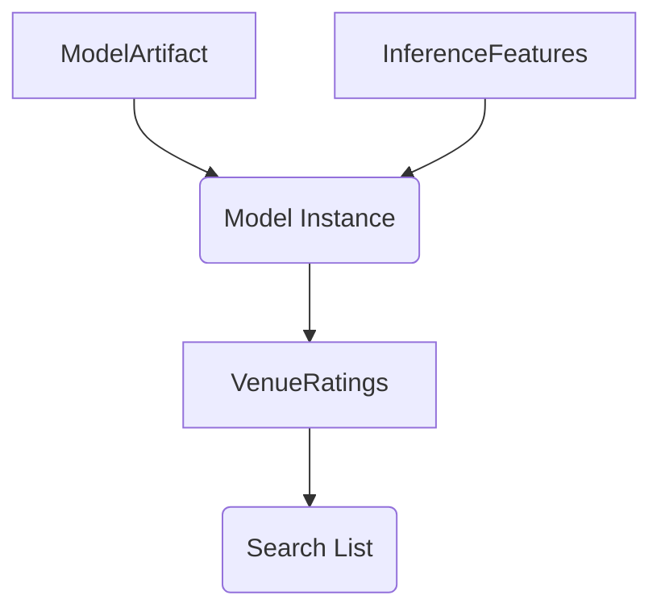

# inference service


[](https://pypi.python.org/pypi/model-server/)

[](https://pypi.python.org/pypi/model-server/)

[](https://pypi.python.org/pypi/model-server/)

[](https://github.com/woltapp/wolt-python-package-cookiecutter)


---

**Documentation**: [https://ra312.github.io/model-server](https://ra312.github.io/model-server)
**Training Source Code**: [https://github.com/ra312/personalization](https://github.com/ra312/personalization)
**Source Code**: [https://github.com/ra312/model-server](https://github.com/ra312/model-server)
**PyPI**: [https://pypi.org/project/model-server/](https://pypi.org/project/model-server/)

---

A service to rate venues

## Installation

```sh
python3 -m pip install recommendation-model-server
```

## Running locally on host
If you choose to use pre-trained model in artifacts/rate_venues.pickle
```sh
python3 -m recommendation_model_server \
--host 0.0.0.0 \
--port 8000 \
--recommendation-model-path artifacts/rate_venues.pickle
```
In separate tab, please run
```sh
curl -X 'POST' \
'http://0.0.0.0:8000/predict' \
-H 'accept: application/json' \
-H 'Content-Type: application/json' \
-d '[
  {
    "venue_id": -4202398962129790000,
    "conversions_per_impression": 0.3556765815,
    "price_range": 1,
    "rating": 8.6,
    "popularity": 4.4884057024,
    "retention_rate": 8.6,
    "session_id_hashed": 3352618370338455600,
    "position_in_list": 31,
    "is_from_order_again": 0,
    "is_recommended": 0
  }
]'
```
## Running in container
```sh
docker pull akylzhanov/my-fastapi-app
docker run -d --name my-fastapi-container -p 8000:8000 --rm akylzhanov/my-fastapi-app
```
## Development

* Clone this repository
* Requirements:
  * [Poetry](https://python-poetry.org/)
  * Python 3.8.1+
* Create a virtual environment and install the dependencies

```sh
poetry install
```

* Activate the virtual environment

```sh
poetry shell
```

### Testing

```sh
pytest tests
```


### Pre-commit

Pre-commit hooks run all the auto-formatters (e.g. `black`, `isort`), linters (e.g. `mypy`, `flake8`), and other quality
 checks to make sure the changeset is in good shape before a commit/push happens.

You can install the hooks with (runs for each commit):

```sh
pre-commit install
```

Or if you want them to run only for each push:

```sh
pre-commit install -t pre-push
```

Or if you want e.g. want to run all checks manually for all files:

```sh
pre-commit run --all-files
```

---

This project was generated using the [wolt-python-package-cookiecutter](https://github.com/woltapp/wolt-python-package-cookiecutter) template.
