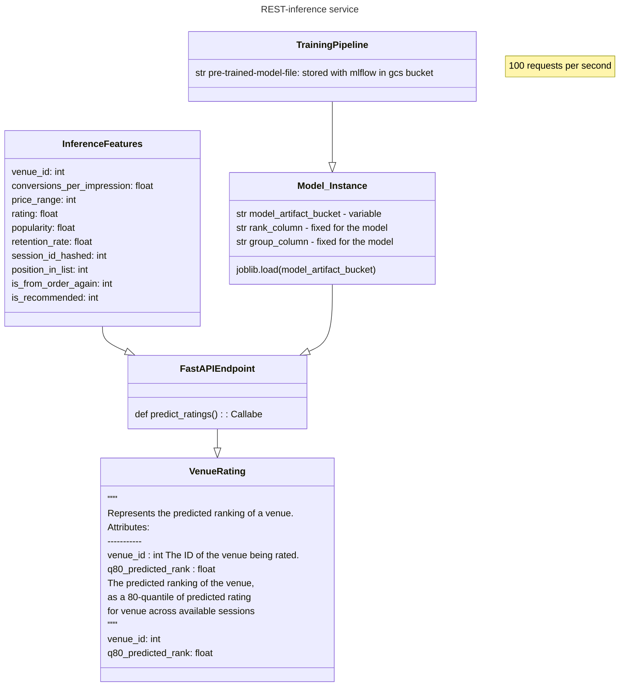

# model server


[](https://pypi.python.org/pypi/model-server/)

[](https://pypi.python.org/pypi/model-server/)

[](https://pypi.python.org/pypi/model-server/)

[](https://github.com/woltapp/wolt-python-package-cookiecutter)


---

**Documentation**: [https://ra312.github.io/model-server](https://ra312.github.io/model-server)
**Training Source Code**: [https://github.com/ra312/personalization](https://github.com/ra312/personalization)
**Source Code**: [https://github.com/ra312/model-server](https://github.com/ra312/model-server)
**PyPI**: [https://pypi.org/project/model-server/](https://pypi.org/project/model-server/)

---

A model server  for almost realtime inference

## Installation

```sh
pip install model-server
```

## Development

* Clone this repository
* Requirements:
  * [Poetry](https://python-poetry.org/)
  * Python 3.8.1+
* Create a virtual environment and install the dependencies

```sh
poetry install
```

* Activate the virtual environment

```sh
poetry shell
```

### Testing

```sh
pytest
```

### Documentation

The documentation is automatically generated from the content of the [docs directory](./docs) and from the docstrings
 of the public signatures of the source code. The documentation is updated and published as a [Github project page
 ](https://pages.github.com/) automatically as part each release.

### Releasing

Trigger the [Draft release workflow](https://github.com/ra312/model-server/actions/workflows/draft_release.yml)
(press _Run workflow_). This will update the changelog & version and create a GitHub release which is in _Draft_ state.

Find the draft release from the
[GitHub releases](https://github.com/ra312/model-server/releases) and publish it. When
 a release is published, it'll trigger [release](https://github.com/ra312/model-server/blob/master/.github/workflows/release.yml) workflow which creates PyPI
 release and deploys updated documentation.

### Pre-commit

Pre-commit hooks run all the auto-formatters (e.g. `black`, `isort`), linters (e.g. `mypy`, `flake8`), and other quality
 checks to make sure the changeset is in good shape before a commit/push happens.

You can install the hooks with (runs for each commit):

```sh
pre-commit install
```

Or if you want them to run only for each push:

```sh
pre-commit install -t pre-push
```

Or if you want e.g. want to run all checks manually for all files:

```sh
pre-commit run --all-files
```

---

This project was generated using the [wolt-python-package-cookiecutter](https://github.com/woltapp/wolt-python-package-cookiecutter) template.
